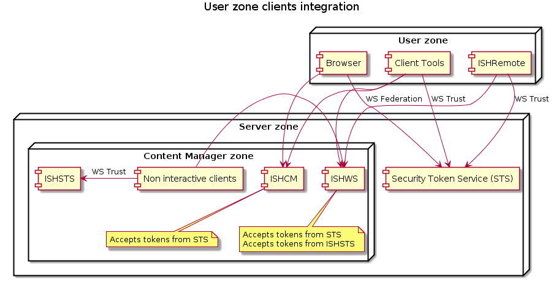

# Integrating with Security Token Service (STS)
 
This article explains how to use the module's commandlets to integrate with a **Security Token Service** also referred to as **STS**.

# Acknowledgements

When a service provider integrated with an STS, it requires some information exchange. In the context of this article the service provider is Content Manager

Content Manager requires knowledge of the following information:

- WS Federation endpoint
- WS Trust endpoint
- WS Trust binding type
- WS Trust Metadata Exchange endpoint
- Token signing certificate thumbprint

The following values assume an STS at `sts.example.com`
CopyCodeBlock(_nopublish\IntegrationValues.ps1)
When the authentication type is Windows then the values change like this
CopyCodeBlock(_nopublish\IntegrationValues.Windows.ps1)

STS required knowledge of the following information:

- The endpoints to create relying parties for
  - ISHCM e.g. `https://ish.example.com/ISHCM`
  - ISHWS e.g. `https://ish.example.com/ISHWS`. Although it is not required it is recommended to create relying parties for each .svc endpoint in **ISHWS** e.g. `https://ish.example.com/ISHWS/Wcf/API25/Application.svc`
- For each **ISHWS** based identifier the public key to encrypt the tokens.
- Expected token claim composition. This drives the claims transformation rules.

# Implementing the integration on Content Manager

There are two kind of integrations:
1. Only the clients not in the server zone use the **STS** at `sts.example.com` to authenticate. All clients within the server zone continue using the internal **ISHSTS**.
2. All clients in the user and server zone use the **STS** at `sts.example.com` to authenticate.

The differences are shown in the following images


## User zone integration

First get a reference to a deployment.
```powershell
$deployment=Get-ISHDeployment -Name InfoShare
```

Then
CopyCodeBlock(Implementation.User.ps1)

## All zone integration

First get a reference to a deployment.
```powershell
$deployment=Get-ISHDeployment -Name InfoShare
```

The internal clients are all non interactive. That means they required a pre-configured set of credentials to use during authentication.
When these clients are redirected to the **STS** at `sts.example.com`, then there are two options

- When the authentication type is windows then the `osuser` credential set will be used
- When the authentication type is username/password then a the `-ActorUsername` and `-ActorPassword` must be provided.

This is an example for a username/password authentication
CopyCodeBlock(Implementation.All.Username.ps1)

This is an example for a windows authentication
CopyCodeBlock(Implementation.All.Windows.ps1)

# Implement the integration on the Security Token Service

For every STS the configuration is different. Therefore the module's `Save-ISHIntegrationSTSConfigurationPackage` generates a set of information that describe the important information for configuring Content Manager's relying parties.
```powershell
$filename="$(Get-Date -Format "yyyyMMdd").IntegrationISH.zip"
Save-ISHIntegrationSTSConfigurationPackage -ISHDeployment $deployment -FileName $filename
```

Inside the zip file you will find two files

- `CM Security Token Service Requirements.md` that is a markdown file with the specific deployment information.
- `ishws.cer` that is the public key of the **ISHWS** service certificate. This is added for your convienience.