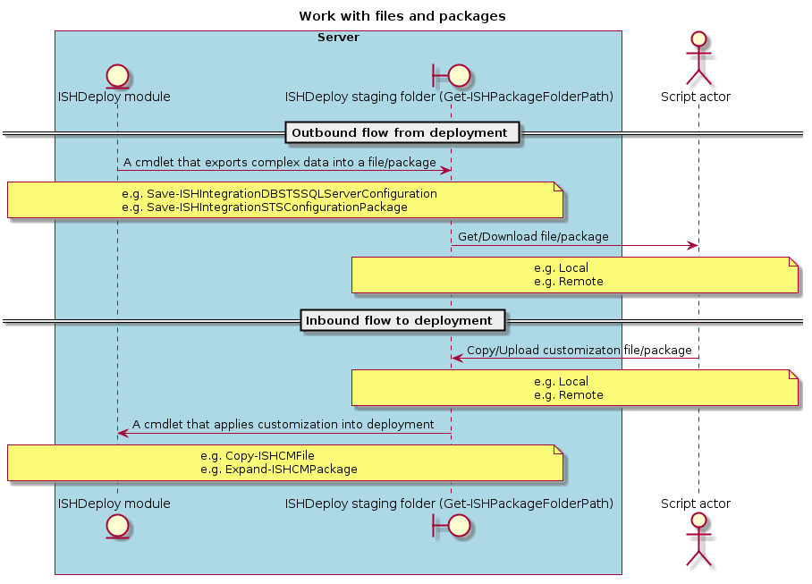

# Work with files and packages
 
This article explains how to work with cmdlets that use files as input or output. All cmdlets use a **FileName** parameter and do not accept values with paths. 
The location of the files is abstracted away and to copy form from/to it the module offers [Get-ISHPackageFolderPath](../../commands/Get-ISHPackageFolderPath.md). 
 
## Cmdlet working with files
Some of the cmdlets of the module depend on a file for their operation or their output is too complicated to write into the console.

The module uses a specific folder within `$env:ProgramData` referred to as the staging folder: 
- All saved files from cmdlets are written in this location.
- All files that drive a cmdlet must first be uploaded in this location.

To abstract the location away, the module provides the `Get-ISHPackageFolderPath` that returns the location in two possible formats:
- Local folder format e.g. `C:\ProgramData\ISHDeploy.X.0.Y\InfoShare\Packages`
- UNC path format e.g. `\\COMPUTER\C$\ProgramData\ISHDeploy.X.0.Y\InfoShare\Packages`. This format is focused on scripts with remote targets.

The following diagram visualizes the flow



## Script target is local
First get the package location.

```powershell
$deploymentName="InfoShare"
$location=Get-ISHPackageFolderPath -ISHDeployment $deploymentName
```

To upload a file from path `$inputFilePath` into the module package directory execute 
```powershell
Copy-Item $inputFilePath $location
```

To download a file with name `$fileName` saved by a module cmdlet to the temp directory execute
```
$sourcePath=Join-Path $location $fileName
Copy-Item $sourcePath $env:TEMP
```

## Script target is remote
In this case we work with a remote computer `$computerName="SERVER"` where the module is deployed. 
To keep the examples simple when using `Invoke-Command` the `$Using` pattern will be used to access local variables from the script block. 

PowerShell v5.0 offers new features with regards to working with files and remote sessions. Depending on the version there are two options.

### PowerShell v4.0
With PowerShell v4.0 we must work with UNC paths.

First get the package location in UNC format.

```powershell
$deploymentName="InfoShare"
$location=Invoke-Command -ComputerName $computerName -ScriptBlock {Get-ISHPackageFolderPath -ISHDeployment $Using:deploymentName -UNC}
```

To upload a file from path `$inputFilePath` into the module package directory execute 
```powershell
Copy-Item $inputFilePath $location
```

To download a file with name `$fileName` saved by a module cmdlet to the temp directory execute
```
$sourcePath=Join-Path $location $fileName
Copy-Item $sourcePath $env:TEMP
```

### PowerShell v5.0
With PowerShell v5.0 we get the ability to drive a cmdlet such as `Copy-Item` with `-FromSession` and `-ToSession`. When using these parameters, also file paths are local to the from/to computer referenced by the session.

First create a `PSSession`, then get the package location in local format.

```powershell
$session=New-PSSession -ComputerName $computerName
$deploymentName="InfoShare"
$location=Invoke-Command -Session $session -ScriptBlock {Get-ISHPackageFolderPath -ISHDeployment $Using:deploymentName}
```

To upload a file from path `$inputFilePath` into the module package directory execute 
```powershell
Copy-Item $inputFilePath $location -ToSession $session
```

To download a file with name `$fileName` saved by a module cmdlet to the temp directory execute
```
$sourcePath=Join-Path $location $fileName
Copy-Item $sourcePath $env:TEMP -FromSession $session
```

## Applying a customization into the deployment

Once the file(s) or package(s) are copied into the module's ([Get-ISHPackageFolderPath](../../commands/Get-ISHPackageFolderPath.md)) folder we need to push it into the correct location of the deployment. 
The module offers a cmdlets for this process that offer a limited set of target locations within the deployment. 
The reason is that the module tries to make a clear distinction between configuration and customization. 
To control the surface of customization while maintaining an easy upgrade path the solution is to own the possible target locations.

### Apply customization to ISHCM folder

Once the customization file(s) or package(s) is copied into the module's folder there are two options:

- To copy one or more files into the ISHCM use `Copy-ISHCMFile`.
- To expand one or more compressed files into the ISHCM use `Expand-ISHCMPackage`.

The two cmdlets do exactly the same thing, with the difference being the type of the source. 
The `Expand-ISHCMPackage` takes an compressed file (package) and copies the contents into the target location as the `Copy-ISHCMFile` would do.

Both cmdlet's offer two target locations

- A `Custom` folder in ISHCM. Use this for custom asp,html, javascript and images.
- The `bin` folder in ISHCM. Use this for binary customization files such as an http module.

The following example showcases how to a customization into the ISHCM custom folder. 
The customization is represented in a zip file or its extracted content.

**Example with files**

```powershell
$deploymentName="InfoShare"

$fileRelativePaths=@(
    "Extensions\custom.js"
    "custom.asp"
    "custom.png"
)

#region Copy the files into the module's staging folder
$targetUploadPath=Get-ISHPackageFolderPath -ISHDeployment $deploymentName
Copy-Item $fileRelativePaths $targetUploadPath
#endregion

#region Copy customization into ISHCM custom folder
Copy-ISHCMFile -ISHDeployment $deploymentName -Filename $fileRelativePaths -ToCustom
#endregion
```

**Example with compressed packages**

```powershell
$deploymentName="InfoShare"

$packageRelativePaths=@(
    "customCM.zip"
)

#region Copy the package into the module's staging folder
$targetUploadPath=Get-ISHPackageFolderPath -ISHDeployment $deploymentName
Copy-Item $packageRelativePaths $targetUploadPath
#endregion

#region Expand customization into ISHCM custom folder
Expand-ISHCMFile -ISHDeployment $deploymentName -Filename $zipFileName -ToCustom
#endregion
```

## Modify a file on the deployment without the module

When necessary to modify a file of the deployment that is not controlled by the module, it's best practice to take a backup first using `Backup-ISHDeployment`. 
It is adviced to modify the target file with code that applies a delta when possible instead of overwriting. 

For example, before modifying the ISHCM's web config file take a backup like this

```powershell
$deploymentName="InfoShare"

Backup-ISHDeployment -ISHDeployment $deploymentName -Web -Path "Author\ASP\Web.config"
```

This process makes sure that when `Undo-ISHDeployment` is executed all original files modified by the module and explicitly requested for backup are reverted. 
Any file modified beyond the module's knowledge will not be reverted when executing `Undo-ISHDeployment`.